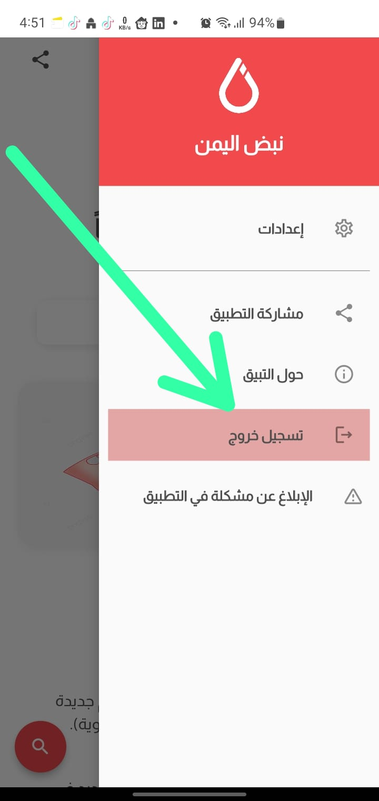

# تطبيق نبض اليمن

## كيفية تسجيل الخروج من التطبيق :
 * بعد تسجيلك للدخول أو إنشاء حساب في التطبيق.
 * التوجه للصفحة الرئيسية. 
 * عرض القائمة الجانبية من الزر الأيمن في الأعلى. 
 * الضغط على زر تسجيل الخروج.
 * سيتم إلغاء تسجيل خروجك من التطبيق وإلغاء الميزات الخاصة بالمستخدم المشترك. 
 * يمكنك تسجيل الدخول مرة أخرى في حال رغبت بالعودة.

  
 <h1>Logout</h1>

